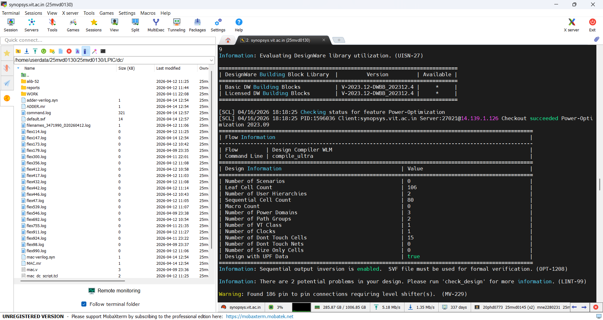
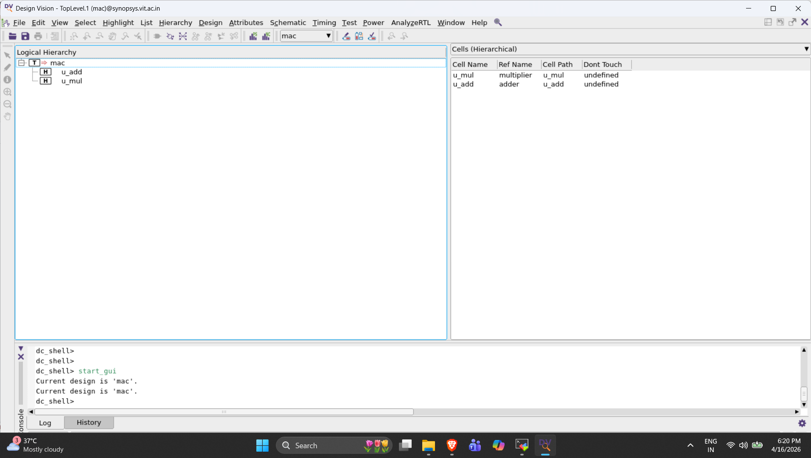

# 8-Bit-MAC-design-with-Multi-VDD---Low-power-Design-methodology-using-UPF-
8-bit Multiply-Accumulate (MAC) unit designed using Multi-VDD architecture and UPF, featuring voltage-aware synthesis, automatic level shifter insertion, and power analysis using Synopsys Design Compiler with SAED14nm technology.


##  Project Overview

Low-power design techniques are essential in modern VLSI systems. This project implements a Multi-VDD architecture where:

- The top-level MAC logic operates at **0.715V (Low VDD)** for power optimization.
- Performance-critical blocks such as the **8-bit Multiplier** and **8-bit Adder** operate at **0.88V (High VDD)**.
- UPF is used to define power intent and enable voltage-aware synthesis.
- Automatic low-to-high and high-to-low level shifters are inserted for safe communication between voltage domains.

---

##  Multi-VDD Architecture

The MAC design is partitioned into three power domains:

| Power Domain | Block | Voltage |
|--------------|-------|---------|
| PD_TOP | Top MAC Module | 0.715V |
| PD_MUL | 8-bit Multiplier | 0.88V |
| PD_ADD | 8-bit Adder | 0.88V |

### Architecture Diagram

<p align="center">

</p>

---

##  UPF Power Intent

The UPF file defines:

- Supply nets and supply ports
- Supply sets
- Multiple power domains
- Power state table (PST)
- Voltage-aware synthesis
- Automatic level shifter insertion

### UPF Power Domain Visualization

<p align="center">

</p>

---

##  Tools and Technology

| Category | Technology |
|----------|------------|
| HDL | Verilog |
| Low Power Format | UPF |
| Synthesis Tool | Synopsys Design Compiler |
| Technology Library | SAED14nm Standard Cell Library |
| Voltage Levels | 0.715V and 0.88V |

---

##  Synthesis Flow

The design was synthesized using Synopsys Design Compiler by loading:

- Low VDD standard cell libraries
- High VDD standard cell libraries
- Level shifter libraries
- UPF power intent file

### Loading Libraries

<p align="center">

</p>

### Sourcing UPF in Design Compiler

<p align="center">

</p>

### Synthesis Status

<p align="center">

</p>

---

##  Level Shifter Insertion

Because signals cross between low and high voltage domains:

- Low-to-high level shifters are inserted at the inputs of high-VDD blocks.
- High-to-low level shifters are inserted at the outputs returning to the low-VDD domain.

### Level Shifters Added After Synthesis

<p align="center">

</p>

**Result:** 83 level shifters were automatically inserted during voltage-aware synthesis.

---

##  Design Hierarchy and Connectivity

### Hierarchy View

<p align="center">

</p>

---

##  Power Analysis

Power reports were generated for:

- MAC design without UPF (Single VDD)
- MAC design with Multi-VDD UPF

The small 8-bit MAC showed increased power after Multi-VDD implementation due to the additional dynamic and leakage overhead of level shifters.

However, Multi-VDD techniques become more effective for larger designs where voltage scaling benefits outweigh level shifter overhead.

---

## 📁 Repository Structure

```
8-Bit-MAC-Multi-VDD/
│
├── Verilog/
│   ├── mac.v
│
├── UPF/
│   └── mac_design.upf
│
├── Images/
│   ├── Loading libraries.png
│   ├── sourcing UPF.png
│   ├── status.png
│   ├── added level shifter.png
│   ├── hierarchy.png
│   ├── multi vdd schematic.png
│   └── upf diagram.png
│
├── Netlist/
│   ├── mac_netlist.v
│   └── mac_without_upf_netlist.v
│
├── Reports/
│   ├── mac_power.rpt
│   ├── mac_area.rpt
│   └── mac_without_upf_area.rpt
│
├── mac.tcl
├── mac_constraints.sdc
└── README.md
```

---

##  Key Results

✔ Created three independent power domains using UPF  
✔ Implemented Multi-VDD architecture (0.715V / 0.88V)  
✔ Performed voltage-aware synthesis in Synopsys DC  
✔ Automatically inserted 83 level shifters  
✔ Generated Multi-VDD gate-level netlist  
✔ Compared power with and without UPF  
✔ Analyzed the trade-off between power savings and level shifter overhead  

---

##  Future Improvements

- Apply Multi-VDD methodology to larger designs.
- Combine Multi-VDD with power gating for better energy efficiency.
- Perform complete backend flow including routing, timing closure, and sign-off.

---
